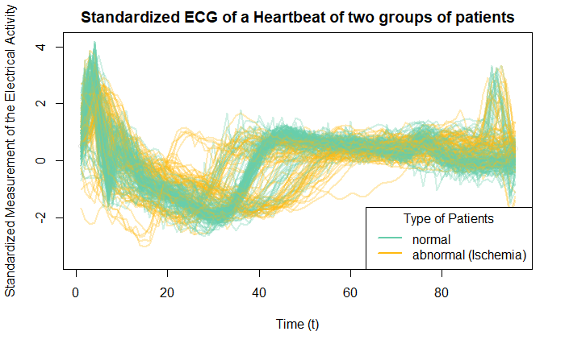
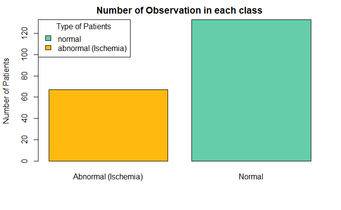
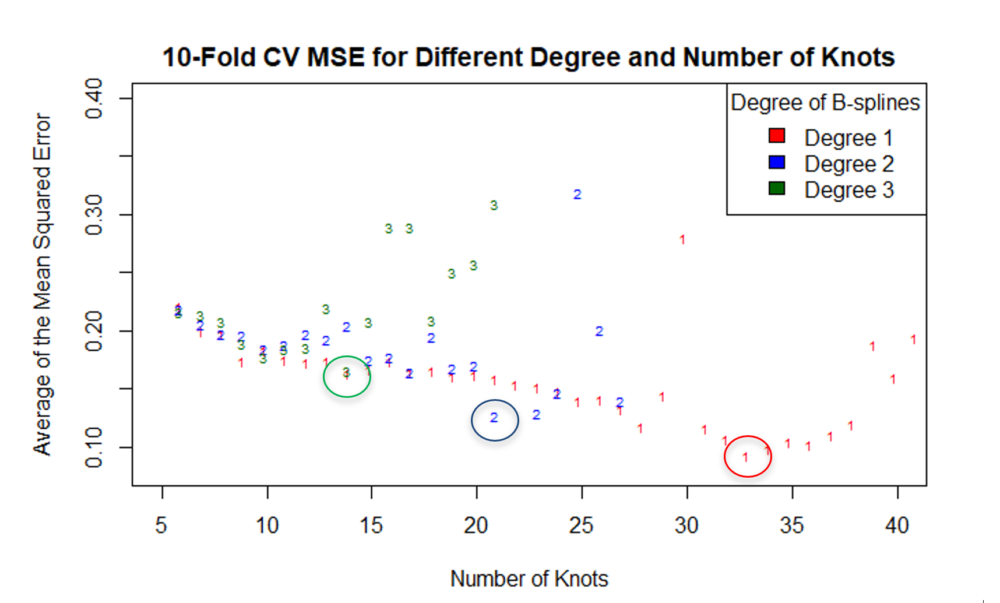
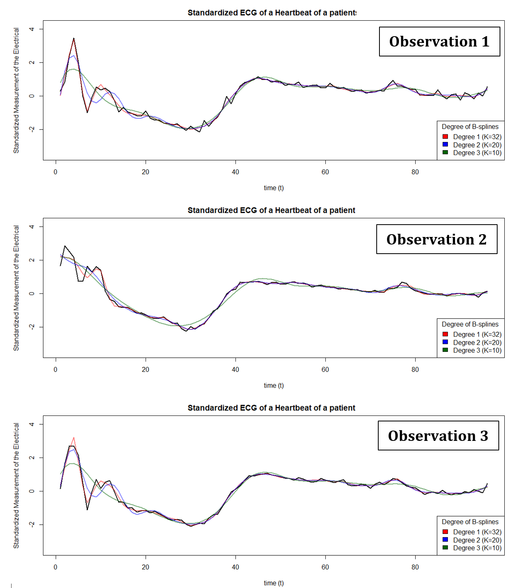
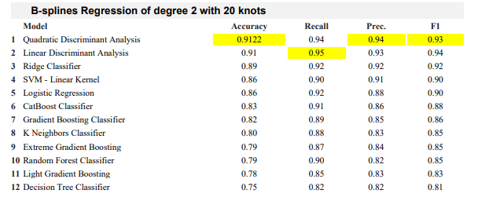
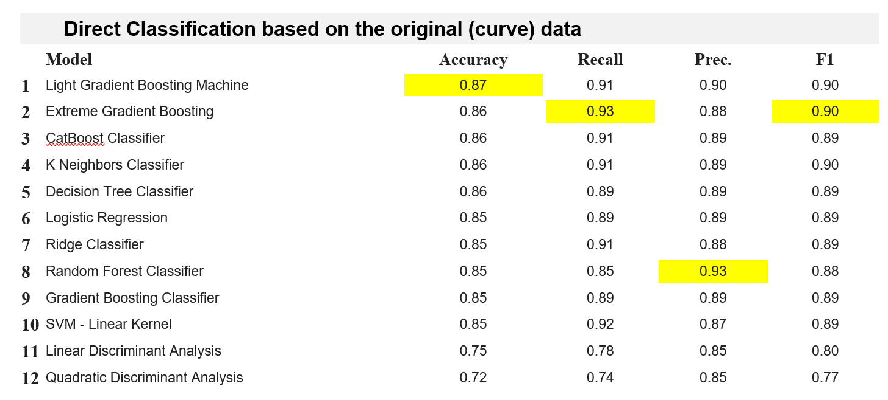
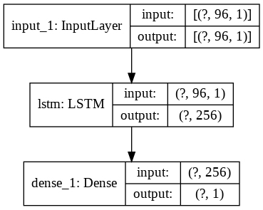
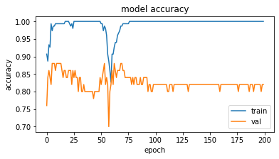

# A B-spline based classification of time-series data
> An introduction to a statistical approach to classifying the time series data using B-splines. 

## Introduction
Data collected through the experiment or observation from different fields of science or nature could come from time-dependent phenomena (time-series data). A special technique is needed to perform the classification method on this type of data. This project will demonstrate the statistical approach to classify the time series data using B-splines. The process consists of two steps, feature extraction via B-splines and applying the machine learning classifier to the extracted features to classify the sample into classes.


## Data 
Here, we are using the ECG dataset that measures the heart's electrical activity, collected by Robert Olszewski. There are n=200 observations (series) where each series reflects 1 heartbeat of an individual which usually takes about a second. The measurement is recorded every 10 milliseconds which results in 96 sample-points per series. There are 2 classes of observation, normal and abnormal (Ischemia). Cardiac ischemia happens when the heart muscle lacks blood flow and oxygen. A long period of cardiac [ischemia](texasheart.org) can cause a heart attack and damage to the heart tissue.

 \
<font size="1">Figure 1 Standardized Measurement of the Electrical Activity of 200 patients represent the normal activity (in green color) and abnormal (in orange color)
</font> 


 In this dataset, 133 series are classified as normal while the remaining 67 are classified as abnormal. Figure 2 shows that in our dataset, the number of normal patients is twice as much of the abnormal patients. This means that we have an unbalance classification problem. Therefore, we will have to be more careful during the model selection step. Additional to the accuracy criteria, precision, recall, and F1-score will be used to assess the classification model’s performance.

 \
<font size="1">Figure 2 A bar chart represents the number of observations in each class
</font> 


## Two-steps classification
It is possible to directly apply the machine learning classifier to the time series data by treating each time point as separate features. However, these models ignore that these data are ordered in time and, hence, does not fully take advantage of the time-series structure in the data. 

### First step: Feature Extraction via B-spline
Feature extraction is a method that extracts a smaller number of features or variables from the original data while accurately contains all the complex information and structure of the original dataset. The B-splines regression is a non-linear smoothing method which is capable of capturing the behavior of the ECG curve both globally and locally. Each observation (a time-series) will be summarized into a few numbers of coefficients obtaining from fitting the B-spline regression. 

A B-splines of *degree d* is a piecewise polynomial function of *degree d* fitted on the smaller subset separated by *k knots* which make them locally sensitive to the data. 

```r
### Fitting a B-splines regression of degree d with k knots. 

# Parameters
d = 2   # polynomial function of degree d
k = 10 # k knots

# Get the knot’s location of k knot spread uniformly across the points of x
quantile_k = to_vec(for(j in 1:k) j / (k+1)) 
knots_location <- quantile(X, quantile_k)

# Fitting the B-spline degree d with k knots
bSplineFit = glm(Y ~ bs(X, degree=d, knots=knots_location), data = dataset)
```

Ten folds cross-validation is used to find the best combination of degree and the number of knots the result in the lowest average value of the mean squared error (MSE) across all observations. The knots are equally distributed.  

```r
### 10-Folds Cross Validation 

cvErr_deg1 = c(); cvErr_deg2 = c(); cvErr_deg3 = c(); knots = c() 
# For each value of k
for (k in 5:40){

    quantile_k = to_vec(for(j in 1:k) j / (k+1)) 
    knots_location <- quantile(X1, quantile_k) 

    cvErr_deg1_i = c(); cvErr_deg2_i = c(); cvErr_deg3_i = c();
    ### For each observation i = 1, ... , 200
    for (i in 1:dim(response)[1]){ 
        temp = data.frame(Y = unlist(response[i,]), X = 1:dim(response)[2] )

        # Fitting different degree of B-spline
        lm.fit_deg1 = glm(Y ~ bs(X, degree= 1, knots=knots_location), data = temp)
        lm.fit_deg2 = glm(Y ~ bs(X, degree= 2, knots=knots_location), data = temp)
        lm.fit_deg3 = glm(Y ~ bs(X, degree= 3, knots=knots_location), data = temp)

        # Performing 10 Folds CV 
        # $delta[1] to retrieve the MSE for each model
        cvErr_deg1_i = c(cvErr_deg1_i, cv.glm(temp, lm.fit_deg1, K = 10)$delta[1])
        cvErr_deg2_i = c(cvErr_deg2_i, cv.glm(temp, lm.fit_deg2, K = 10)$delta[1])
        cvErr_deg3_i = c(cvErr_deg3_i, cv.glm(temp, lm.fit_deg3, K = 10)$delta[1])
    }

    cvErr_deg1 = c(cvErr_deg1, mean(cvErr_deg1_i))
    cvErr_deg2 = c(cvErr_deg2, mean(cvErr_deg2_i)) 
    cvErr_deg3 = c(cvErr_deg3, mean(cvErr_deg3_i)) 
    knots = c(knots, k)
}
```

 \
<font size="1">Figure 3 shows the average of the mean squared error across all patients for each combination of d and K.
</font> 

In figure 3, it appears that the B-splines regression of degree 1 with 32 knots (circled in red) has the lowest average of the MSE. However, given that there are only 96 data points for each observation, it means that, for 32 knots, there are only 3 data points for each linear spline which could suggest that this might be overfitting the curve. We can see in the figure 4 that the B-spline of degree 1 with 32 knots (the red curve) is overfitting, it is almost identical to the actual observation. Therefore, we will use the B-splines regression of degree 2 with 20 knots to extract the feature since it can capture both global and local trends, as shown in the green curve.

 \
<font size="1">Figure 4 Fitted curve of the selected B-splines with different degree and knots on three different observations.
</font> 


### Second step: Classification
After the feature extraction process, we now have a vector of coefficients of each patient, denoted it as $x_i \in \R^{K+d+1}$, which will be used as features (independent variables) to train a classifier. The target binary variable $Y$ has two values, Normal and Ischemia. 

There are many different types (models) of classifier such as generative classifier, discriminative classifier, tree-based model, or parametric model. Since our objective is to construct the model that performs best (highest predictability), we will not be constraint with a certain classifier model but, instead, we will be testing out several models and using cross-validation to select the best model. 

Since we have an imbalance problem, the accuracy metric alone is not enough information for us to select the best model. We will consider recall, precision, and F1 score as well. For this purpose, we want to make sure that the risk of not alerting a person which may be sick is minimal. In other words, we want to minimize the *Missing Rate* or *False Negative Rate* `FalseNegativeRate = False Negative / Number of all positive` where `False Negative` is when the model indicate that the Ischemia (abnormal) patient is normal. This is equivalent to finding the model that maximize the Recall since `FalseNegativeRate = 1 - Recall`.

# Result (In progress)
## Two-stages classification (our method)
The dataset was randomly split into training and testing set (9:1) in a stratified fashion based on the class label. The testing set consist of 20 patients (7: abnormal and 13: normal). The performance metric based on test dataset are summarized in Table 1. Overall, Linear Discriminant Analysis model with the predictors extracted from the B-spline regression of degree 2 with 20 knots performs the best among other classification models with the highest Recall and the highest F1 score of 0.95 and 0.94, respectively.


<font size="1">**Table 1** The performance metric based on the test dataset from 12 different classifiers 
</font> 

## Direct Classification based on the original data 

## LSTM



